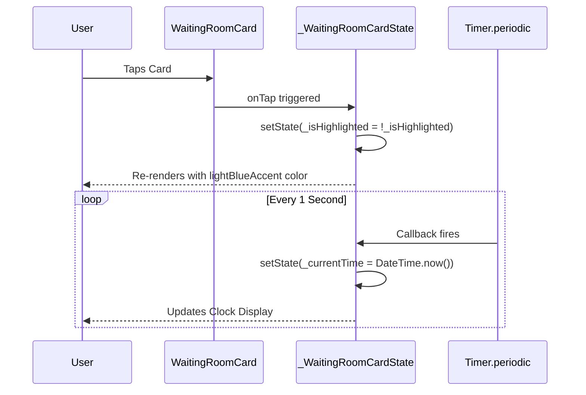
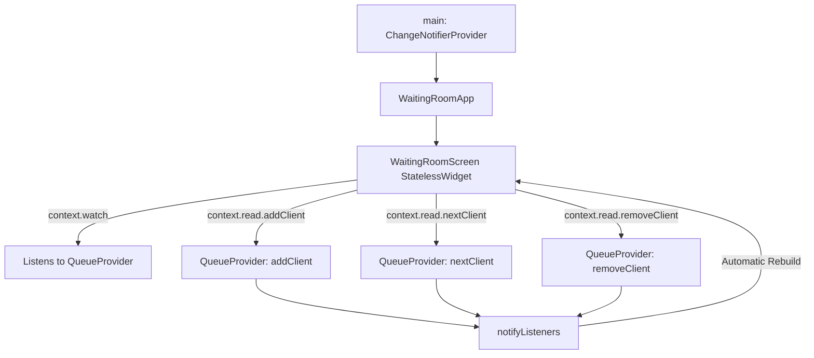

# Complete Documentary: Flutter State Management Evolution & TDD
## Workshops 1, 2, and 3 (TP1, TP2, TP3)

---

## 📖 Executive Summary & Learning Journey

This documentary details the progressive design, architecture, implementation, and testing of three interconnected Flutter applications developed across **Workshops 1, 2, and 3**:

1. **Workshop 1 (TP1) – UI Basics, Local State, and Widget Lifecycle (`tp1_flutter`)**:
   Constructing modular UI components, managing ephemeral widget state with `StatefulWidget` and `setState()`, and handling active background timers with lifecycle safety (`initState()` and `dispose()`).
2. **Workshop 2 (TP2) – State Management Basics & Test-Driven Development (TDD) (`tp2_flutter`)**:
   Decoupling business logic from UI using a dedicated manager class (`WaitingRoomManager`) and adhering strictly to the **Red-Green-Refactor** TDD workflow with both unit tests and widget tests.
3. **Workshop 3 (TP3) – Scalable Reactive Architecture with Provider (`waiting_room_app`)**:
   Transitioning to enterprise-grade reactive state management using the **Provider** package (`provider: ^6.0.0`) and `ChangeNotifier`, eliminating prop drilling, converting screens to performant `StatelessWidget`s, and implementing FIFO queue processing.
4. **AI-Assisted Pair Programming**:
   How AI acted as an autonomous pair programmer to enforce TDD, structure maintainable Dart code, resolve diagnostics, automate verification, and generate documentation.

---

## 🗂️ Project Map & Directory Structure

```
crospllatform/
│
├── tp1_flutter/                    # Workshop 1: UI & Ephemeral State
│   ├── lib/
│   │   ├── main.dart               # App entry & basic layout
│   │   ├── waiting_room_card.dart  # Interactive greeting card (setState)
│   │   └── waiting_room_timestamp.dart # Live 1s timer widget (initState/dispose)
│   └── test/
│       └── waiting_room_card_test.dart # Widget tests for card rendering & tap
│
├── tp2_flutter/                    # Workshop 2: TDD & Manager Separation
│   ├── lib/
│   │   ├── main.dart               # WaitingRoomApp & WaitingRoomScreen
│   │   └── waiting_room_manager.dart # Pure Dart business logic class
│   └── test/
│       ├── waiting_room_manager_test.dart # Unit tests (add/remove client)
│       └── waiting_room_widget_test.dart  # Widget tests (UI interactions)
│
└── waiting_room_app/               # Workshop 3: Provider & Reactive State
    ├── lib/
    │   ├── main.dart               # ChangeNotifierProvider & StatelessWidget Screen
    │   └── queue_provider.dart    # ChangeNotifier state model (add, remove, nextClient)
    └── test/
        ├── waiting_room_manager_test.dart # Unit tests for QueueProvider
        └── waiting_room_widget_test.dart  # Widget tests verifying Provider reactivity
```

---

## 🔬 Workshop 1 (TP1): UI Basics, Local State & Timers

### 1. Overview & Objective
The goal of TP1 is to learn Flutter's foundational building blocks: building custom UI widgets, organizing layout trees (`Scaffold`, `Center`, `Column`, `Card`, `Padding`), maintaining local state using `StatefulWidget`, and managing external resources (such as active timers) cleanly.

### 2. Classes & Functions Breakdown

#### A. `MyApp` (`lib/main.dart`)
- **Type:** `StatelessWidget`
- **`Widget build(BuildContext context)`**:
  - Initializes the top-level `MaterialApp`.
  - Configures the `Scaffold` with an `AppBar` titled `"Waiting Room"`.
  - Centers the main component: `WaitingRoomCard(name: 'Najjar Iheb')`.

#### B. `WaitingRoomCard` (`lib/waiting_room_card.dart`)
- **Type:** `StatefulWidget`
- **Fields:**
  - `final String name`: The name of the client to display.
- **`State<WaitingRoomCard> createState()`**: Creates the mutable state object `_WaitingRoomCardState`.

#### C. `_WaitingRoomCardState` (`lib/waiting_room_card.dart`)
- **State Property:**
  - `bool _isHighlighted = false`: Tracks whether the card is in its highlighted (active) state.
- **`Widget build(BuildContext context)`**:
  - Wraps the card in a `GestureDetector`.
  - **`onTap` Callback**: Calls `setState(() { _isHighlighted = !_isHighlighted; })`. When tapped, Flutter flags this widget as dirty and rebuilds its UI.
  - Returns a `Card` whose `color` dynamically evaluates to `_isHighlighted ? Colors.lightBlueAccent : null`.
  - Renders the client's name in bold text alongside the `WaitingRoomTimestamp` widget.

#### D. `WaitingRoomTimestamp` (`lib/waiting_room_timestamp.dart`)
- **Type:** `StatefulWidget`
- **State Object:** `_WaitingRoomTimestampState`
- **`void initState()`**:
  - Called exactly once when the widget is inserted into the tree.
  - Initializes `_currentTime = DateTime.now()`.
  - Spawns a background `Timer.periodic(const Duration(seconds: 1), ...)` that runs every 1000ms and calls `setState()` to advance `_currentTime`.
- **`void dispose()`**:
  - Lifecycle cleanup hook called when the widget is permanently removed from the tree.
  - Calls `_timer.cancel()` to ensure no background timer leaks memory or attempts to trigger `setState()` on an unmounted widget.
- **`Widget build(BuildContext context)`**:
  - Formats the date string (`_currentTime.toString().split('.')[0]`) and displays `"Current Time: YYYY-MM-DD HH:MM:SS"`.

### 3. How It Works Under the Hood


### 4. Testing Suite
- **File:** `test/waiting_room_card_test.dart`
- **Tests:**
  1. `WaitingRoomCard displays the name correctly`: Verifies that `"Hello,"` and `'Alice'` are rendered.
  2. `WaitingRoomCard changes its background color when tapped`: Taps the card with `tester.tap()`, calls `tester.pump()`, and asserts that the `Card`'s color switches from `null` to `Colors.lightBlueAccent`.

---

## ⚡ Workshop 2 (TP2): State Management Basics & TDD

### 1. Overview & Objective
Moving from a static single card to an interactive queue system. TP2 introduces **Test-Driven Development (TDD)** and **Separation of Concerns**. Instead of embedding list manipulation inside UI widgets, business logic is isolated in a pure Dart class (`WaitingRoomManager`) tested before any UI is created.

### 2. The TDD Cycle: Red, Green, Refactor
1. **Red (Failing Test First):** Write a unit or widget test defining the expected behavior before writing the implementation. Run `flutter test` and confirm it fails.
2. **Green (Minimal Implementation):** Write the simplest code possible to satisfy the test. Run `flutter test` and confirm it passes.
3. **Refactor:** Clean up code, remove duplication, and optimize while relying on the tests as a safety net.

### 3. Classes & Functions Breakdown

#### A. `WaitingRoomManager` (`lib/waiting_room_manager.dart`)
- **Type:** Pure Dart Business Logic Class (Zero UI dependencies)
- **State Property:**
  - `final List<String> _clients = []`: Private internal collection of client names.
- **`List<String> get clients`**: Read-only public getter exposing the queue.
- **`void addClient(String name)`**: Appends a new client to the end of `_clients`.
- **`void removeClient(String name)`**: Removes the given client name from `_clients`.

#### B. `WaitingRoomApp` & `WaitingRoomScreen` (`lib/main.dart`)
- **`WaitingRoomApp`**: `StatelessWidget` configuring `MaterialApp(home: WaitingRoomScreen())`.
- **`WaitingRoomScreen`**: `StatefulWidget` managing the interactive waiting room screen.

#### C. `_WaitingRoomScreenState` (`lib/main.dart`)
- **State Properties:**
  - `final WaitingRoomManager _manager = WaitingRoomManager()`: Manages queue data.
  - `final TextEditingController _controller = TextEditingController()`: Captures input text.
- **`void _addClient()`**:
  - Checks if `_controller.text.isNotEmpty`.
  - Executes `setState(() { _manager.addClient(_controller.text); _controller.clear(); })`.
  - Rebuilds the UI to reflect the updated queue count and list items.
- **`void dispose()`**:
  - Disposes `_controller` to prevent memory leaks.
- **`Widget build(BuildContext context)`**:
  - **Input Row:** `TextField` + `ElevatedButton(child: Text('Add'), onPressed: _addClient)`.
  - **Queue Counter:** `Text('Clients in Queue: ${_manager.clients.length}')`.
  - **List Display:** `ListView.builder` iterating through `_manager.clients`. Each client appears in a `Card` > `ListTile` with a trailing `IconButton(icon: Icon(Icons.delete))` that calls:
    ```dart
    setState(() {
      _manager.removeClient(clientName);
    });
    ```

### 4. Testing Suite
- **Unit Tests (`test/waiting_room_manager_test.dart`)**:
  - `should add a client to the waiting list`: Asserts `length == 1` and `first == 'John Doe'`.
  - `should remove a client from the waiting list`: Adds 2 clients, removes 1, asserts `length == 1` and remainder is `'Jane Doe'`.
- **Widget Tests (`test/waiting_room_widget_test.dart`)**:
  - `should add a new client to the list on button tap`: Types `'Alice'`, taps `'Add'`, asserts `'Alice'` and `'Clients in Queue: 1'` exist.
  - `should remove a client from the list when the delete button is tapped`: Adds `'Bob'`, taps `find.byIcon(Icons.delete)`, asserts `'Bob'` is gone and counter is `0`.

---

## 🚀 Workshop 3 (TP3): Scalable Reactive Architecture with Provider

### 1. Overview & Objective
While `setState()` works well for local state, large applications suffer from tight coupling and prop drilling. TP3 refactors the waiting room into a decoupled, reactive architecture using **Provider** (`ChangeNotifier` & `ChangeNotifierProvider`). The screen widget becomes a `StatelessWidget`, and business logic lives entirely within `QueueProvider`.

### 2. Classes & Functions Breakdown

#### A. `QueueProvider` (`lib/queue_provider.dart`)
- **Type:** Extends `ChangeNotifier` (implements the Observer Pattern).
- **State Property:**
  - `final List<String> _clients = []`: Internal private list of clients.
- **`List<String> get clients => _clients`**: Public accessor.
- **`void addClient(String name)`**:
  - Appends `name` to `_clients`.
  - Calls `notifyListeners()`: Broadcasts an update event to all listening widgets.
- **`void removeClient(String name)`**:
  - Removes `name` from `_clients`.
  - Calls `notifyListeners()`.
- **`void nextClient()` (FIFO Queue Serving)**:
  - If `_clients.isNotEmpty`, removes the first client at index `0` (`_clients.removeAt(0)`).
  - Calls `notifyListeners()`.

#### B. `main()` & `ChangeNotifierProvider` (`lib/main.dart`)
```dart
void main() {
  runApp(
    ChangeNotifierProvider(
      create: (context) => QueueProvider(),
      child: const WaitingRoomApp(),
    ),
  );
}
```
- Injects an instance of `QueueProvider` at the top of the widget tree so all child widgets can access it without manual constructor passing.

#### C. `WaitingRoomScreen` (`lib/main.dart`)
- **Type:** `StatelessWidget` (no internal mutable state!).
- **How It Accesses State:**
  - **`context.watch<QueueProvider>()`**: Subscribes to changes. When `notifyListeners()` is triggered, only this widget rebuilds. Used for the counter and the list view.
  - **`context.read<QueueProvider>()`**: Accesses methods without subscribing to rebuilds. Used in `onPressed` handlers:
    - Adding client: `context.read<QueueProvider>().addClient(name)`
    - Deleting client: `context.read<QueueProvider>().removeClient(name)`
    - Serving next client: `context.read<QueueProvider>().nextClient()` (triggered by the `Icons.skip_next` button in the AppBar).

### 3. How It Works Under the Hood


### 4. Testing Suite
- **Unit Tests (`test/waiting_room_manager_test.dart`)**:
  - `should add a client to the waiting list`
  - `should remove a client from the waiting list`
  - `should remove the first client when nextClient() is called`
- **Widget Tests (`test/waiting_room_widget_test.dart`)**:
  - Verifies adding client through the UI using Provider.
  - Verifies individual client deletion using Provider.
  - Verifies `nextClient()` FIFO serving via the `Icons.skip_next` AppBar button.

---

## 📊 Architectural Evolution & Comparison Matrix

| Feature | Workshop 1 (`tp1_flutter`) | Workshop 2 (`tp2_flutter`) | Workshop 3 (`waiting_room_app`) |
| :--- | :--- | :--- | :--- |
| **Primary Focus** | UI Layout & Widget Lifecycle | TDD & Logic Separation | Reactive Scalable State |
| **State Scope** | Ephemeral (inside single widget) | Local (widget manages Manager) | Global / App-wide via DI |
| **State Tool** | `setState()` | `setState()` + pure Dart class | `ChangeNotifier` + `Provider` |
| **Screen Widget Type** | `StatefulWidget` | `StatefulWidget` | `StatelessWidget` |
| **Test Types** | Widget Test | Unit Test + Widget Test (TDD) | Unit Test + Provider Widget Test |
| **Decoupling** | Low (Logic inside State) | Medium (Separated logic class) | High (Clean MVVM / Observer) |
| **Queue Operations** | None (Single Card) | Add, Delete | Add, Delete, Serve Next (FIFO) |

---

## 🤖 The Role of AI in Development (AI Pair Programming)

During these workshops, the AI assistant functioned as an active **Senior Pair Programmer**:

### 1. Enforcing Test-Driven Development (TDD)
- The AI guided the strict **Red-Green-Refactor** discipline:
  - Drafting unit test specifications (`waiting_room_manager_test.dart`) before writing implementations.
  - Writing only the minimal code needed to pass the tests.
  - Running automated tests via command line to verify transitions from Red to Green.

### 2. Architecture & Refactoring Guidance
- Guided the progressive refactoring from Workshop 1's ephemeral widget state into Workshop 2's pure logic classes, and finally into Workshop 3's reactive Provider architecture.
- Identified potential issues like unmanaged `TextEditingController` instances and uncancelled `Timer.periodic` instances, ensuring proper `dispose()` lifecycle handling.

### 3. Automated Diagnostic & Quality Assurance
- Handled automated runs of `flutter test` across all three codebases, ensuring 100% pass rates across unit and widget tests.
- Executed `flutter analyze` to ensure zero compilation warnings, deprecated API usages, or lint errors.

### 4. Multi-Port Web Server Deployment
- Launched independent, concurrent Flutter web servers (`ports 8081, 8082, 8083`) for all three apps simultaneously, allowing the developer to visually inspect and interact with the evolution of the application side by side in real time.

---

## 🛠️ How to Run and Test All Three Apps

Run each command from the respective project folder:

### 1. Running Tests
```powershell
# Workshop 1
cd tp1_flutter; flutter test

# Workshop 2
cd ../tp2_flutter; flutter test

# Workshop 3
cd ../waiting_room_app; flutter test
```

### 2. Running the Apps on Web
```powershell
# Workshop 1 (Port 8081)
cd tp1_flutter
flutter run -d chrome --web-port 8081

# Workshop 2 (Port 8082)
cd tp2_flutter
flutter run -d chrome --web-port 8082

# Workshop 3 (Port 8083)
cd waiting_room_app
flutter run -d chrome --web-port 8083
```
