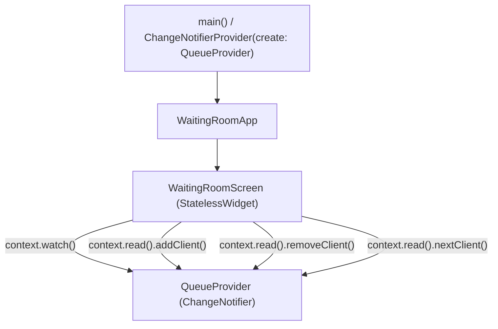

# Waiting Room App — Documentation

## 1. About The Application

### What is the App?
The **Waiting Room App** is a Flutter cross-platform application developed using **Test-Driven Development (TDD)** and structured state management using the **Provider** package (`ChangeNotifier` + `ChangeNotifierProvider`).

### What Does the App Do?
The application manages a real-time waiting room / queue for clients (e.g., at a medical clinic, service desk, or administrative office):
1. **Add Clients**: Users can enter a client's name into a text field and tap the **Add** button. The client is immediately added to the waiting queue.
2. **Display Queue Count**: The screen shows a live counter (`Clients in Queue: X`) that automatically updates whenever a client enters or leaves.
3. **List Waiting Clients**: Every client currently in the queue is listed in a scrollable card view (`ListView.builder`).
4. **Delete Specific Client**: Each client card has a delete button (trash icon) to cancel or remove that individual client from anywhere in the queue.
5. **Call Next Client (FIFO)**: The top application bar includes a **Next Client** button (`Icons.skip_next`). When pressed, it serves/removes the person who has been waiting the longest (the first person in line at index `0`).

---

## 2. Architecture & State Management

The app uses **Provider** instead of local `setState()`:
- **No Prop-Drilling**: The state is provided at the root and accessed directly by any child widget.
- **Efficient Rebuilds**: Only widgets that need updates rebuild when state changes.
- **Separation of Concerns**: Business logic is separated completely into `QueueProvider` without UI dependencies.

---

## 3. Code Breakdown & Functions

### File: `lib/queue_provider.dart`

This class extends `ChangeNotifier` and acts as the central business logic model.

| Property / Method | Description |
|---|---|
| `final List<String> _clients` | Private list that holds the names of clients currently in the waiting room in order of arrival. |
| `List<String> get clients` | Public getter that exposes `_clients` so the UI can read the list without directly mutating it. |
| `void addClient(String name)` | Appends a new client name to the queue (`_clients.add(name)`) and calls `notifyListeners()` to update the UI. |
| `void removeClient(String name)` | Removes a specific client from the queue by name (`_clients.remove(name)`) and calls `notifyListeners()`. |
| `void nextClient()` | Checks if the list is not empty (`_clients.isNotEmpty`), removes the client at index `0` (`_clients.removeAt(0)`), and calls `notifyListeners()`. Implements First-In, First-Out (FIFO) queuing. |

---

### File: `lib/main.dart`

Contains the UI components and Provider configuration.

| Component / Function | Description |
|---|---|
| `void main()` | The entry point of the app. Wraps `WaitingRoomApp` inside `ChangeNotifierProvider(create: (context) => QueueProvider(), child: const WaitingRoomApp())` so the provider is accessible anywhere in the widget hierarchy. |
| `WaitingRoomApp` | Root `StatelessWidget` configuring `MaterialApp` (title, debug banner settings) and setting `WaitingRoomScreen` as the home screen. |
| `WaitingRoomScreen` | A `StatelessWidget` presenting the user interface. It replaces the old `StatefulWidget` because all mutable state lives in `QueueProvider`. |
| `context.watch<QueueProvider>()` | Subscribes `WaitingRoomScreen` to changes in `QueueProvider`. Whenever `notifyListeners()` is called, the widget automatically rebuilds. |
| `context.read<QueueProvider>()` | Used in click handlers (`onPressed`) to trigger methods (`addClient`, `removeClient`, `nextClient`) without subscribing to unnecessary re-renders. |
| `TextEditingController _controller` | Manages and reads user input in the client name `TextField`. Cleared with `_controller.clear()` when a client is added. |
| `AppBar.actions (IconButton)` | Renders the "Next Client" button with `Icons.skip_next` and `key: const Key('nextClientButton')`. Calls `context.read<QueueProvider>().nextClient()`. |
| `ListView.builder` | Lazily builds card items for each client in `queueProvider.clients`. |

---

## 4. Test Suite (TDD Implementation)

All features were built using the **Test-Driven Development (TDD)** Red-Green-Refactor cycle.

### Unit Tests: `test/waiting_room_manager_test.dart`
Tests the pure Dart business logic of `QueueProvider`:
1. `should add a client to the waiting list`: Verifies that calling `addClient()` increases the list length and correctly stores the name.
2. `should remove a client from the waiting list`: Verifies that calling `removeClient()` correctly removes an existing client.
3. `should remove the first client when nextClient() is called`: Verifies that `nextClient()` removes the first client from the list while keeping subsequent clients.

### Widget Tests: `test/waiting_room_widget_test.dart`
Tests the UI and its connection with Provider:
1. `should add a new client to the list on button tap`: Types into the `TextField`, taps `Add`, and verifies that the name and updated queue count appear.
2. `should remove a client from the list when the delete button is tapped`: Adds a client, taps `Icons.delete`, and verifies that the client is removed.
3. `should remove the first client from the list when "Next Client" is tapped`: Adds `Client A` and `Client B`, taps the `nextClientButton`, and verifies `Client A` is gone, `Client B` remains, and the counter displays `1`.
